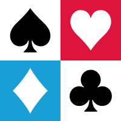

# [Taipei Forcing Club System Notes](https://jdh8.github.io/bridge-systems/)

This book is a collection of my bidding systems.  I have been studying forcing
club systems since reading *Good, Better, Best* by Jan Eric Larsson, whose
simulations show that forcing club systems tend to outperform other systems.
I believe opening 1♣ for all strong hands is a superior treatment.

Strawberry Polish Club is a BTU-flavored Polish Club largely based on *Polish
Club 2020: Expert*.  Polish Club serves as a gateway to the world of forcing
clubs.  It is 5-card major.  Its main opening range is 12--17. Sharing these
properties, it has similar bidding structure to 2/1, the lingua franca of modern
bridge.

Blueberry Cottontail Club is a modernized mix of Blue Club and Cottontail Club
along with new ideas from BTU.  It is a 4-card major strong club system with a
moderately strong notrump.  It is highly experimental and subject to change
without notice.

## Legacy system notes

- [Strawberry Polish Club](https://jdh8.github.io/bridge-systems-1.0/wj.htm)
- [Blueberry Club](https://jdh8.github.io/bridge-systems-1.0/blue.htm)
- [Defensive bidding system](https://jdh8.github.io/bridge-systems-1.0/defense.htm)

## References

### General methods

- Jan Eric Larsson.  *Good, Better, Best: A comparison of bridge bidding
  systems and conventions by computer simulation*.  ISBN 978-1771402415
- Thomas Andrews.  [Thomas's Bridge Fantasia](https://bridge.thomasoandrews.com/valuations/)
- Bridge Base.  [GIB Bid Descriptions](https://www.bridgebase.com/doc/gib_descriptions.php)

### Polish Club

- Krzysztof Jassem & Tomek Brus.  *Polish Club 2020: Expert*.  ISBN 978-1771402248
- Krzysztof Jassem & Tomek Brus.  *Polish Club 2020: Standard*.  ISBN 978-1771402231
- Krzysztof Jassem.
  [Wspólny Język 2020 Standard](https://jassem.pl/wp-content/uploads/2019/12/wj2020-25-59.pdf)
- Piotr Cegielski.
  [Wspólny Język DUCE](https://iccs.pl/wp-content/uploads/2020/11/Wspolny-Jezyk-DUCE-wersja-Q1.2021.pdf)
- Krzysztof Jassem.
  [Polish Club International 2010](https://jassem.pl/wp-content/uploads/2016/08/Polish_Club-2010.html)
- Krzysztof Jassem.
  [Wspólny Język 2005 (Polish Standard)](https://par.cse.nsysu.edu.tw/~kbc/class/Polish_Club/WJ2005Full_original.pdf)

### Precision Club

- Daniel Neill.  *Standard Modern Precision: Getting from Here to There*.  ISBN
  978-1771401791
- Edward Piwowar.
  [PC - Meckwell Lite Precision Club](https://sites.google.com/view/bbaenglish/description-of-systems/pc-meckwell-lite-precision-club)

### Other strong clubs

- Arturo Franco, Marco Pancotti, and Daniel J. Neill.
  [Blue Team Club](https://bridgewithdan.com/wp-content/uploads/2019/07/BTC2000_gmeier.pdf)
- Jan Eric Larsson, Anu Uus, and George Wang.
  [Kaninklöver / Cottontail Club: A Cheatsheet (2022)](https://github.com/Egroegw/Kaninklover)
- Bo-Yin Yang.
  [Terrorist's Moscito, or Major-Oriented Strong Club, with Interpid Two Openers](https://bridgewithdan.com/wp-content/uploads/2022/01/terr_mosc.pdf)
